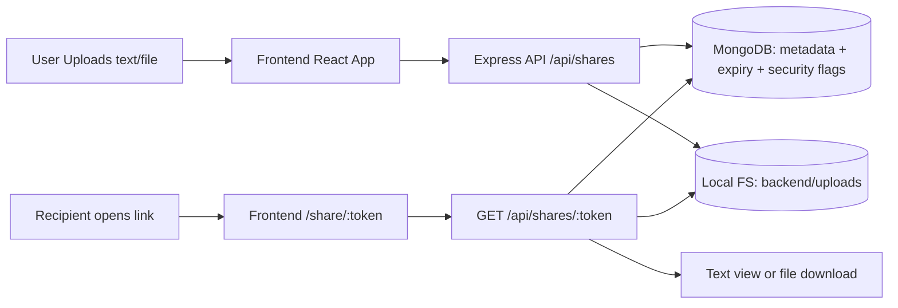

# LinkVault

Full-stack secure text/file sharing app with auth, user activity, admin moderation, and report workflow.


## Stack
- Frontend: React + Vite + Tailwind CSS
- Backend: Node.js + Express + Multer
- Database: MongoDB + Mongoose
- Auth: JWT

## Project structure
- `frontend/` React app (create/retrieve link UI)
- `backend/` API + Mongo models + file storage

## Run instructions
### First Time Setup (only once)
1. Create MongoDB data folder:
```powershell
mkdir C:\data\db -Force
```
2. Setup backend:
```powershell
cd D:\Personal_Projects\LinkVault\backend
npm install
```
3. Setup frontend:
```powershell
cd D:\Personal_Projects\LinkVault\frontend
npm install
```

### From Next Time (every time you start app)
Open 3 terminals.

1. Terminal 1: start MongoDB
```powershell
mongod --dbpath C:\data\db
```

2. Terminal 2: start backend
```powershell
cd D:\Personal_Projects\LinkVault\backend
npm run dev
```
Backend runs on `http://localhost:4000`

3. Terminal 3: start frontend
```powershell
cd D:\Personal_Projects\LinkVault\frontend
npm run dev
```
Frontend runs on `http://localhost:5173`

Mongo URI used by backend:
`mongodb://localhost:27017/linkvault`

## Backend environment
Set these values in `backend/.env`:

```env
PORT=4000
MONGODB_URI=mongodb://localhost:27017/linkvault
BASE_URL=http://localhost:4000
JWT_SECRET=change-this-secret
ADMIN_EMAIL=admin@linkvault.local
ADMIN_PASSWORD=Admin@1234
DEFAULT_EXPIRY_MINUTES=30
MAX_FILE_SIZE_MB=20
UPLOAD_DIR=uploads
```

## API overview
Base URL: `http://localhost:4000`

### Health
`GET /health`

### Create share (text or file)
`POST /api/shares`
- `multipart/form-data`
- auth required: `Authorization: Bearer <token>`
- fields:
  - `text` or `file` (exactly one required)
  - `expiresAt` (optional ISO datetime, default +30 mins)
  - `password` (optional)
  - `oneTimeView` (`true`/`false`, optional)
  - `maxViews` (optional positive integer)

### Register / Login
- `POST /api/auth/register` with `{ name, email, password }`
- `POST /api/auth/login` with `{ email, password }`
- `GET /api/auth/me` (auth required)

### User history
- `GET /api/shares/mine` (auth required)

### Delete own share (admin can delete any)
- `DELETE /api/shares/id/:shareId` (auth required)

### Report a link as vulgar
- `POST /api/shares/:token/report` (auth required)
- body: `{ reason?: string }`

### Admin APIs
- `GET /api/admin/users` (admin only)
- `GET /api/admin/users/:userId/shares` (admin only)

### Retrieve metadata/content by token
`GET /api/shares/:token`
- optional header: `x-access-password`
- For text: returns text body in JSON
- For file: returns file metadata + download URL

### Download file
`GET /api/shares/:token/download`
- optional header: `x-access-password`

## Design decisions
- Secret, hard-to-guess token (`crypto.randomBytes`) is used as the only access key.
- Users must authenticate before creating links.
- Owner is stored for each link to support per-user history and deletion.
- Admin account exists as both a regular user and moderator (user listing + content control).
- Reported content is attached to a link for moderation visibility.
- TTL index on `expiresAt` auto-deletes records in MongoDB.
- Files are stored on disk, and record metadata/path is stored in MongoDB.
- Passwords are hashed with Node `scrypt` + random salt.
- Login sessions use JWT bearer tokens.

## Assumptions and limitations
- Single instance deployment with local disk storage.
- Expired records are eventually removed by MongoDB TTL monitor (not immediate to the second).
- Uploaded files are deleted from disk on explicit delete API.
- Uploaded files are not automatically deleted from disk by TTL alone (record is removed by Mongo TTL). A cleanup worker can be added.
- One-time-view count increments on successful retrieval/download route hit.

## High-level data flow

