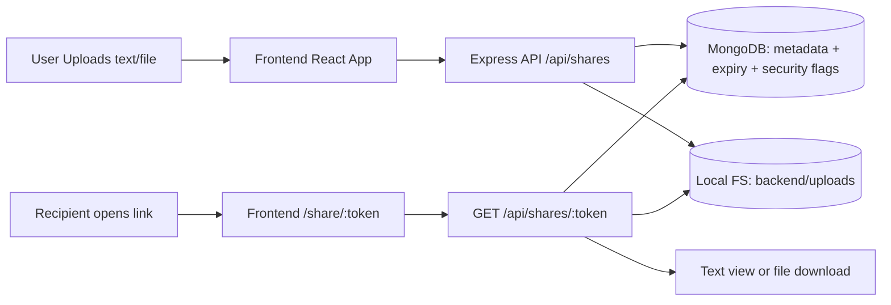

# LinkVault

Full-stack pastebin/file-share app built for the take-home assignment.

## What changed per your request
- No Firebase usage.
- File storage uses local filesystem (`backend/uploads/`), i.e. system storage.
- Database uses MongoDB at `localhost:27017` by default.
- Additional (bonus) features implemented:
  - Password-protected links
  - One-time-view links

## Stack
- Frontend: React + Vite + Tailwind CSS
- Backend: Node.js + Express + Multer
- Database: MongoDB + Mongoose

## Project structure
- `frontend/` React app (create/retrieve link UI)
- `backend/` API + Mongo models + file storage

## Run instructions
### First Time Setup (only once)
1. Create MongoDB data folder:
```powershell
mkdir C:\data\db -Force
```
2. Setup backend:
```powershell
cd D:\Personal_Projects\LinkVault\backend
copy .env.example .env
npm install
```
3. Setup frontend:
```powershell
cd D:\Personal_Projects\LinkVault\frontend
copy .env.example .env
npm install
```

### From Next Time (every time you start app)
Open 3 terminals.

1. Terminal 1: start MongoDB
```powershell
mongod --dbpath C:\data\db
```

2. Terminal 2: start backend
```powershell
cd D:\Personal_Projects\LinkVault\backend
npm run dev
```
Backend runs on `http://localhost:4000`

3. Terminal 3: start frontend
```powershell
cd D:\Personal_Projects\LinkVault\frontend
npm run dev
```
Frontend runs on `http://localhost:5173`

Mongo URI used by backend:
`mongodb://localhost:27017/linkvault`

## API overview
Base URL: `http://localhost:4000`

### Health
`GET /health`

### Create share (text or file)
`POST /api/shares`
- `multipart/form-data`
- fields:
  - `text` (optional, mutually exclusive with file)
  - `file` (optional, mutually exclusive with text)
  - `expiresAt` (optional ISO datetime, default +30 mins)
  - `password` (optional bonus feature)
  - `oneTimeView` (`true`/`false`, optional bonus feature)

### Retrieve metadata/content by token
`GET /api/shares/:token`
- optional header: `x-access-password`
- For text: returns text body in JSON
- For file: returns file metadata + download URL

### Download file
`GET /api/shares/:token/download`
- optional header: `x-access-password`

## Design decisions
- Secret, hard-to-guess token (`crypto.randomBytes`) is used as the only access key.
- No list/search endpoint, preventing public discovery.
- TTL index on `expiresAt` auto-deletes records in MongoDB.
- Files are stored on disk, and record metadata/path is stored in MongoDB.
- Passwords are hashed with Node `scrypt` + random salt.

## Assumptions and limitations
- Single instance deployment with local disk storage.
- Expired records are eventually removed by MongoDB TTL monitor (not immediate to the second).
- Uploaded files are not automatically deleted from disk by TTL alone (record is removed). A cleanup worker can be added if required.
- One-time-view count increments on successful retrieval/download route hit.

## High-level data flow


