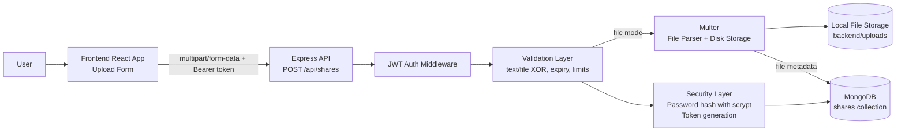
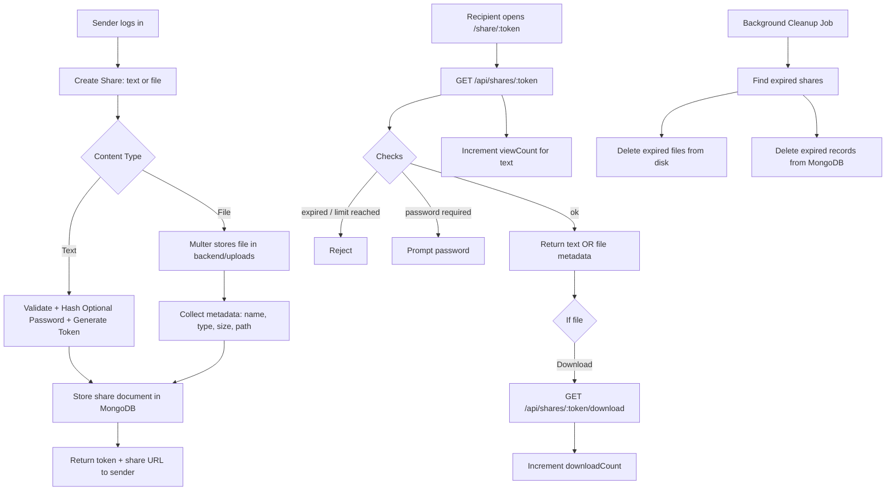

# Data Flow Diagram (High-Level Architecture)

## Upload to DB Storage Flow

## End-to-End High-Level Flow

## Quick 
- Frontend: React + Vite
- API: Node.js + Express
- Upload parsing: Multer
- DB: MongoDB (via Mongoose)
- File store: local disk (`backend/uploads`)
- Auth: JWT bearer token
